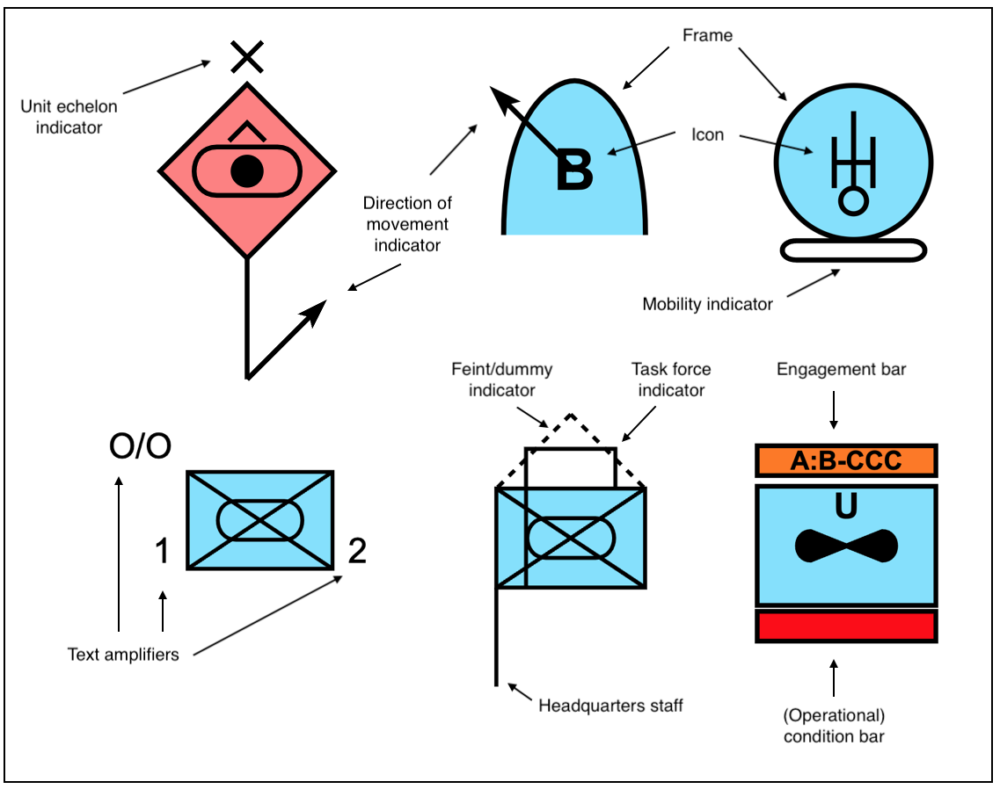
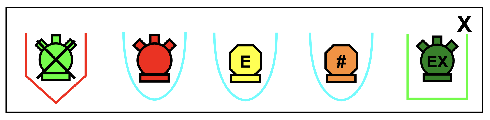
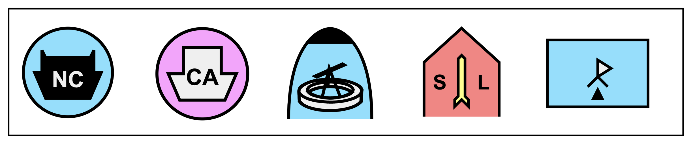

### Symbol Styling

This is an attempt to structure the process of styling military symbols. If successful this document may also explain the code to some extend. The actual representation of a symbol depends on information derived from **SIDC** and properties given by the user in form of **style hints**. Let's start off with all parts which can make up a symbol. The possible set of parts which can be displayed for a symbol depends on the symbol type, usually defined implicitly by its SIDC. 

#### Symbol Parts

Naming the individual parts of a symbol is essential to this endeavor.

`frame` - Symbols other than tactical points/control measures usually have a frame. Its shape and fill color identify the affiliation of the symbol. Not all symbol have a fill color though. For sea mines for example, the affiliation is depicted as the frames stroke color, also there is quite some variation for fill colors:

 

`icon` - Most symbols have a icon within the frame. An icon can be composed of one or more  components, each of which might have different styling:

The right most icon for example has two fill colors: white and black.

`engagement` - Engagement bar is pretty straight forward. Only the fill and text colors change with AT text amplifier (TARGET, NON-TARGET, EXPIRED).

`condition` - Operational condition has different fill colors. 

There is nothing special about those indicators: `echelon`, `mobility`, `headquarters`, `feint/dummy`, `taskforce` and `movement`.